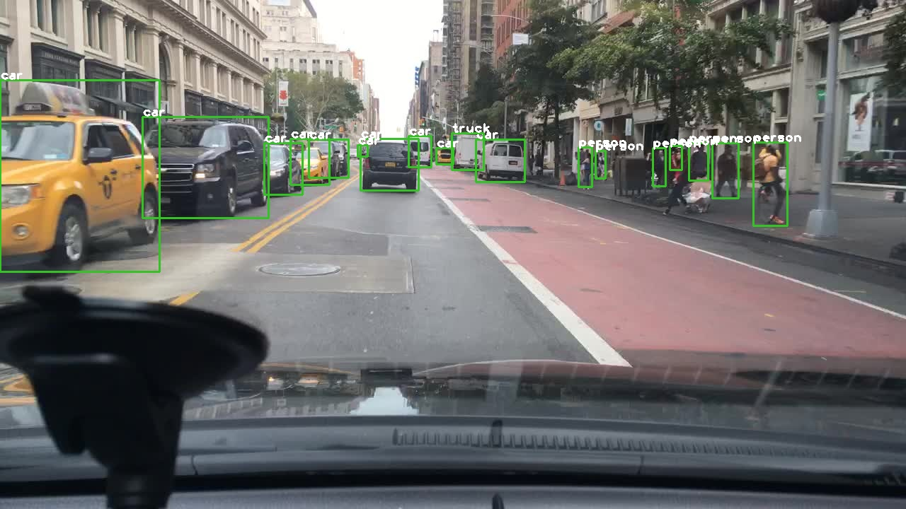
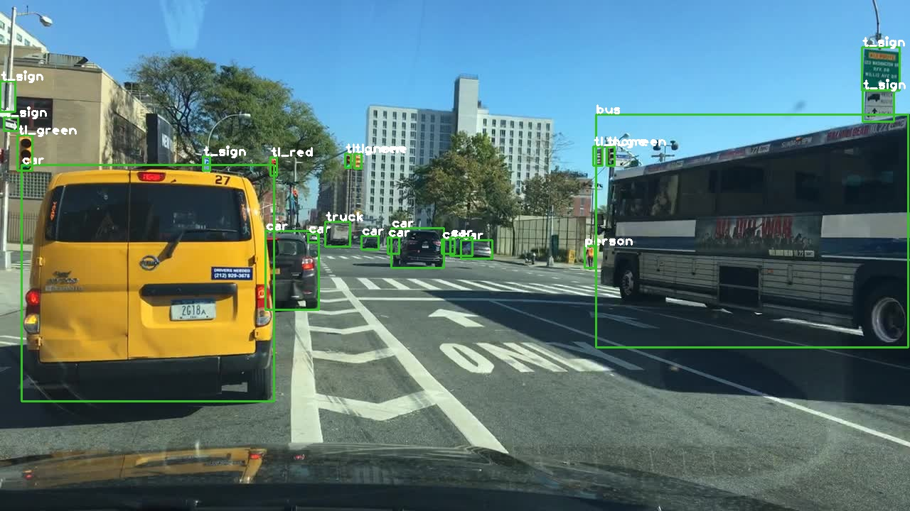

# yolov5

The Pytorch implementation is [ultralytics/yolov5](https://github.com/ultralytics/yolov5).

this reposity is introduced from [tensorrtx/yolov5@1.0](https://github.com/wang-xinyu/tensorrtx/tree/yolov5-v1.0) and suitable for [yolov5-bdd100k](https://github.com/williamhyin/yolov5s_bdd100k)

## How to Run

```
1. generate yolov5s-bdd.wts from pytorch implementation with yolov5s-bdd.pt
git clone https://github.com/williamhyin/yolov5s_bdd100k.git
// transform its weights into 'yolov5s-bdd.pt'
cd yolov5s_bdd100k/runs/exp0_yolov5s_bdd_prew/weights/
cp best_yolov5s_bdd_prew.pt [yolov5s_bdd100k主目录下]
cp ./tensorrt/gen_wts.py .
python gen_wts.py
// a file 'yolov5s-bdd.wts' will be generated.(also provided the wts file)

2. put yolov5s-bdd.wts into tensorrt, build and run

mv yolov5s-bdd.wts ./tensorrt/
cd ./tensorrt/
mkdir build
cd build
cmake ..
make
sudo ./yolov5s -s             // serialize model to plan file i.e. 'yolov5s.engine'
sudo ./yolov5s -d  ../samples // deserialize plan file and run inference, the images in samples will be processed.
sudo ./yolov5s -d  ../exmaple.mp4 //eserialize plan file and run inference with video input

3. check the images generated, as follows.
input image folder = samples
output image folder = outputs 
if you would like to find the detection result with txt file, you can change the code in line 228 `bool save_txt = false;`
output deteciton txt information = detection-results(class + conf + center_x + center_y + w + h)
output video result = result.avi
```




## mAP testing
testing mAP in tensorrt with [mAP](https://github.com/Cartucho/mAP.git)
by move the detection-results into mAP/input/detection-results, and `pythons3 main.py`
For details, see [mAP](https://github.com/Cartucho/mAP)
## Config

- Input shape defined in yololayer.h
- Number of classes defined in yololayer.h
- FP16/FP32 can be selected by the macro in yolov5s.cpp
- GPU id can be selected by the macro in yolov5s.cpp
- NMS thresh in yolov5s.cpp
- BBox confidence thresh in yolov5s.cpp
- Batch size in yolov5s.cpp

## More Information

See the readme in [home page.](https://github.com/wang-xinyu/tensorrtx)

